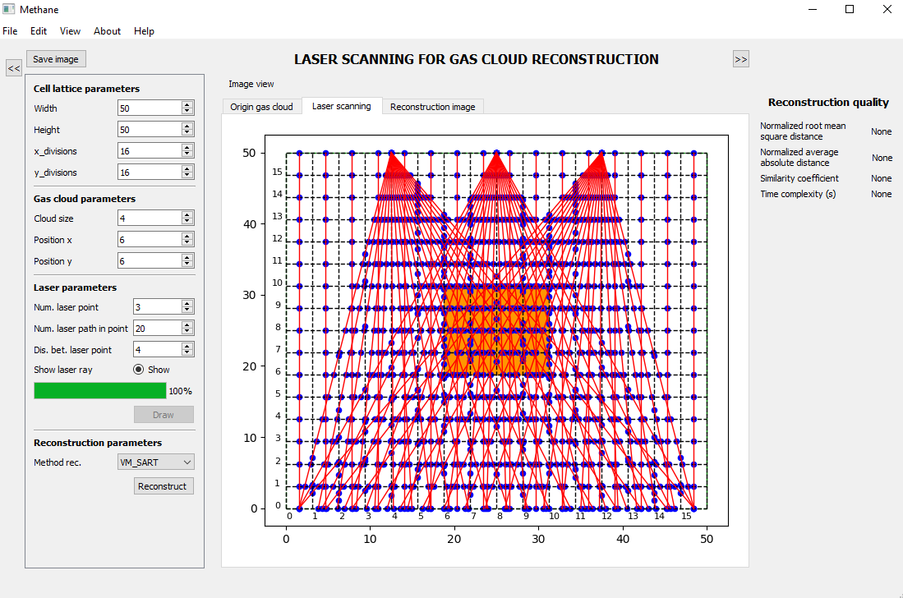

# Laser scanning for gas cloud reconstruction program

## User Interface

The graphical user interface is designed using **Qt Designer** and is stored in the `form.ui` file.



If you modify the user interface using Qt Designer, you must regenerate the Python UI file before running the project.

After making changes to `form.ui`, run the following command from the project directory:

```bash
python -m PyQt5.uic.pyuic form.ui -o New_window.py
```

This command converts the `form.ui` file into the Python file `New_window.py`.

**Important:** Whenever `form.ui` is modified, run the command above again to update `New_window.py`.

## Running the Project

The main Python file of the project is `GasDis.py`.

After completing the model setup and generating `New_window.py`, run:

```bash
python GasDis.py
```

Make sure Python, PyQt5, and all other required dependencies have been installed before running the project.
